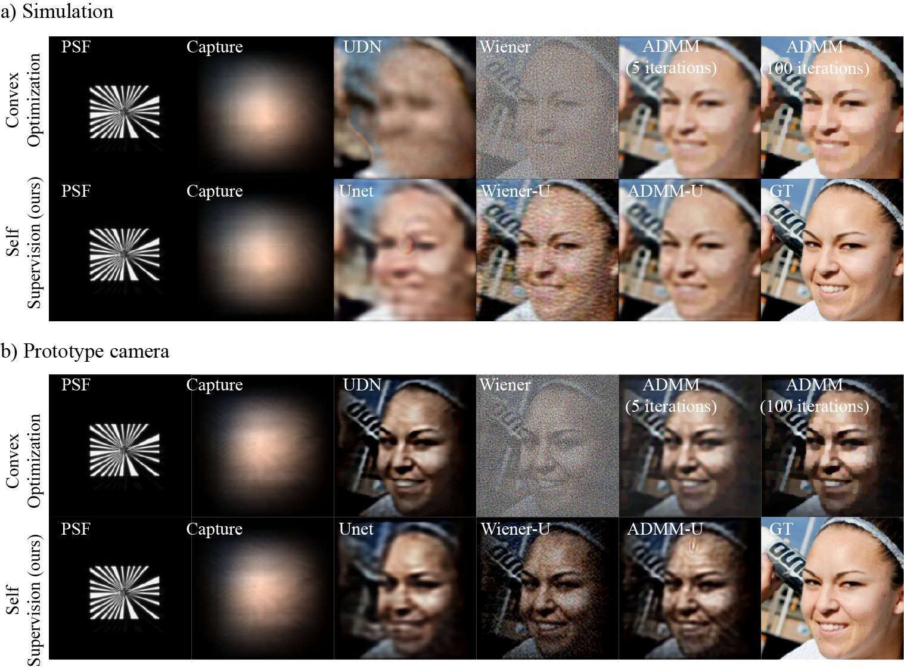

# Self Supervised Neural Reconstructions for Lensless Imaging

Official repository of the paper "Self-supervised Neural Reconstructions for Lensless Imaging"


---
## Abstract

> __Recent advances in lensless imaging reconstruction have primarily relied on supervised neural models trained using target images captured by lensed cameras via a beam splitter. However, we argue that using reference images from a different optical system introduces bias into the reconstruction process. To mitigate this issue, we propose a self-supervised approach that leverages data-fidelity guidance, similar to deep image prior, to train neural models for single-iteration lensless reconstruction. Through simulations and prototype camera experiments, we demonstrate that combining simple convex optimization methods with a denoising UNet improves perceptual quality (LPIPS), accelerates inference compared to traditional optimization techniques, and reduces potential unwanted biases in
the reconstruction network__



---


## Create new environment (recommended) 
Using conda:
```bash
conda create -n ssl python=3.11

conda activate ssl
```

## Install dependencies
```bash
pip3 install torch torchvision torchaudio --index-url https://download.pytorch.org/whl/cu128

pip3 install pyyaml==6.0.2 tqdm==4.67.1 matplotlib==3.10.1 tensorboard==2.19.0
```

---

## Usage
Steps:
1) Create or download the dataset for simulated and prototype camera experiments, respectively (Check dataset section for more information)
2) (Optional) Train the model using the config files (templates are provided in ./configs/prototype/)
3) Test the trained (or pretrained) model using the test script

### Dataset
- Simulation:
   1) download the first 21k images from the [FFHQ](https://drive.google.com/drive/folders/1u2xu7bSrWxrbUxk-dT-UvEJq8IjdmNTP) dataset
   2) Run the script to generate the dataset (modifying the path to the FFHQ dataset, and output path as desired):
     ```bash
         data_path="path_to_FFHQ_dataset/"
         output_path="path_to_output_dataset/"
         psf_path="psf/simulation/256/radial_6per.npy"
         noise_std=0.005
     
         python scripts/create_dataset.py --data_path $data_path --psf_path $psf_path --output_path $output_path --noise_std $noise_std
     ```
- Prototype camera: Download the dataset from [link](https://drive.google.com/drive/folders/1LG-6gWBrCuhZYl7DPLXpxO2jtAu6Wk8P?usp=sharing) (coming soon), it should have 20k training images and 1k testing images.
  - Note that the files downloaded from the link are preprocessed to the 250x250 resolution used in the paper.


### Training
Steps:
1) Update the config file relative of the desired neural model at ./configs/prototype/ to point to the train/test data folders
   - leadmmu_FFHQ_1.yaml: for ADMM-U model
   - wiener_FFHQ_1.yaml: for Wiener-U model
   - unet_FFHQ.yaml: for purely UNet model
2) Run the training script passing the path to the config file:
```bash
python train.py --config path_to_config_file
```
training results will be saved in the save_path field specified in the config file.

### Testing
Execute the following command to test the trained model using the same config file used for training:
```bash
python3 test.py --config path_to_config_file
```
The reconstructions will be saved in the ./reconstructions/ folder within a sub-folder specified in the config file's save_path field.

--- 
## Citation
If you used our code, dataset, or results, please cite our work:
```bibtex
@article{SilvaNeto2025SelfSupervisedLensless,
  title={Self-supervised Neural Reconstructions for Lensless Imaging},
  author={Cunha Santos A V Silva Neto, Jose Reinaldo and Kawachi, Hodaka and Yagi, Yasushi and Nakamura, Tomoya},
  journal={Optical Review},
  year={2025}
}
```

---
## Acknowledgements
This work was supported by JST FOREST (JPMJFR206K).

## Source codes
We acknowledge the following source codes used in this work:

1) ADMM source code from [Waller-Lab/DiffuserCam](https://github.com/Waller-Lab/DiffuserCam) (adapted for our use case)
2) UNet model source code from [Waller-Lab/LenslessLearning](https://github.com/Waller-Lab/LenslessLearning) (adapted for our use case)
3) UDN (Skip UNet) model source code from [Waller-Lab/UDN](https://github.com/Waller-Lab/UDN) (adapted for our use case)

